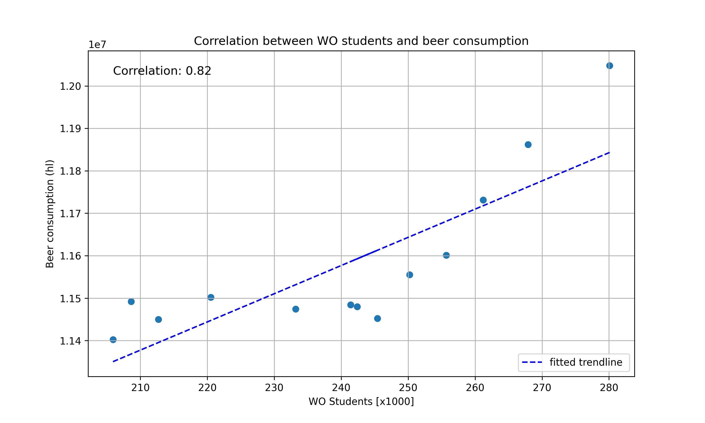

Student number: 15395812
name: Imaan Bijl 

- Van Dyke, M. C. C., Thompson, G. R., Galgiani, J. N., & Barker, B. M. (2019). Fantastic yeasts and where to find them: the hidden diversity of dimorphic fungal pathogens. https://www.sciencedirect.com/science/article/abs/pii/S136952741930013X?via%3Dihub

- Harvey, J. T., Culvenor, J., Payne, W., Cowley, S., Lawrance, M., Stuart, D., & Williams, R. (2002). An analysis of the forces required to drag sheep over various surfaces. Applied Ergonomics, 33(6), 523–531. https://doi.org/10.1016/S0003-6870(02)00071-6

- Zeigler, D. W., Wang, C. C., Yoast, R. A., Dickinson, B. D., McCaffree, M. A., Robinowitz, C. B., & Sterling, M. L. (2005). The neurocognitive effects of alcohol on adolescents and college students. Preventive Medicine, 40(1), 23–32. https://doi.org/10.1016/j.ypmed.2004.04.044

There seems to be a correlation, though a causation remains unsure. Note that correlation could also be caused by other factors, and does not necessarily mean a direct causal relationship. 

